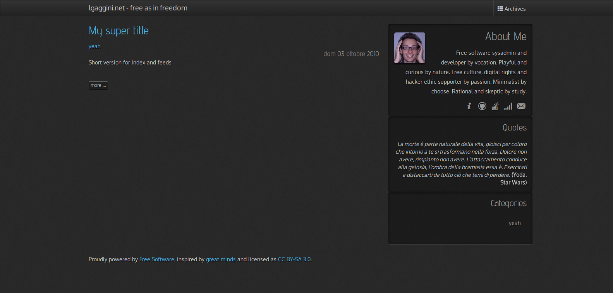
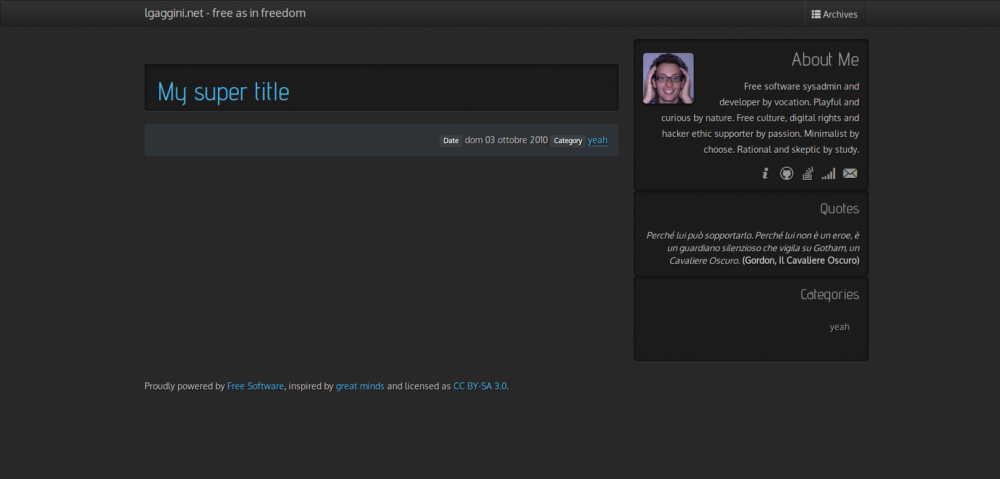

# slathool

This is a mixed port of [jekyll hooligan theme](https://github.com/dhulihan/hooligan) by [dhulihan](https://github.com/dhulihan) to pelican, builded on top of the [pelican-bootstrap3 theme](https://github.com/DandyDev/pelican-bootstrap3) by [DandyDev](https://github.com/DandyDev), in slate version from [Bootswatch](http://bootswatch.com) by [Thomas Park](https://github.com/thomaspark).

## Installation

First:

`git clone https://github.com/lgaggini/slathool.git`

Then:

Point the `THEME` variable in your `pelicanconf.py` to `/path/to/slathool`

## Usage

This theme honors the following standard Pelican settings:

* Putting feeds in the `<head>` section:
    * `FEED_ALL_ATOM`
* Template settings:
    * `DISPLAY_PAGES_ON_MENU`
    * `MENUITEMS`
* Analytics & Comments
    * `DISQUS_SITENAME`

plus custom settings:

* Site slogan, next to site title
    * `SITE_SLOGAN`
* Short info for about box
    * `ABOUT`
* Minimal social icon link for about box
    * `GRAVATAR`
    * `SOCIAL_GITHUB`
    * `SOCIAL_STACKEXCHANGE`
    * `SOCIAL_STACKCARRERS`
    * `SOCIAL_EMAIL`
    * `SOCIAL_PGP`
* Random quote plugin
    * `RANDOM_QUOTE`

## Extras

### reStructuredText styles

If you're using reStructuredText for writing articles and pages, you can include the extra CSS styles that are used by the `docutils`-generated HTML by setting `DOCUTIL_CSS` to True. This can be done as a global setting or  setting it in the metadata of a specific article or page.

## Screenshot

